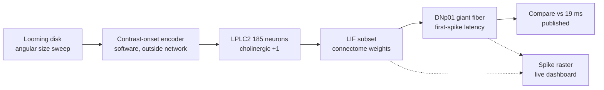

# Architecture

## What the system is

A measurement harness that drives a real spiking network with stimulus *timing*, reads the descending-neuron response, and compares the result to published electrophysiology.

It is an experiment, not an application. The output is a number and a confidence in that number, not an action.



## Component boundaries

| Layer | Responsibility | Where |
|---|---|---|
| **Encoding** | Frame → precisely-timed spike train | **New, in-window.** `scripts/looming.py`, and `dashboard/src/lib/spike-encoder.ts` for live camera input |
| **Simulation** | LIF dynamics, synaptic delivery, weights | **Frozen.** Reused unmodified from source |
| **Readout** | Spike counts → latency, first-spike, separability | **New, in-window.** `scripts/upstream_drive.py`, `measure_final.py` |
| **Experiment** | Sweep, seeds, statistics, falsification checks | **New, in-window.** `scripts/measure_*.py` |
| **Backend** | Serves the measurement; runs no simulation | **New, in-window.** `scripts/serve.py`, stdlib only |
| **Dashboard** | Single self-explanatory view of the measurement | **New, in-window.** React 19 + Tailwind 4 |
| **Reference** | Published values to test against | `docs/Biological-Reference.md`, complete |

### What is frozen and why

The simulation core is reused **unmodified**. Changing weight construction or LIF constants would invalidate comparison against Shiu et al. 2024, which is the entire basis of the reference comparison. `AGENTS.md` §6 requires this: a stale or altered weight cache produces plausible-looking wrong numbers.

Only two things change: how drive enters (timing, not rate) and how the output is read (latency, not rate).

## Neuron selection

Selected by the biology, not by a threshold. Card & von Reyn and PLOS Biol 2025 establish that **97.5% of visual input to the giant fiber comes from LPLC2 (52.2%) and LC4 (45.2%)** — the only two sources.

This means a backward-from-the-output selection rule and the empirical anatomy arrive at the same answer independently. The rule is therefore checkable, not a heuristic.

Primary path: **LPLC2 (185 neurons in subset) → DNp01 (2 neurons)**. Verified present: 185 edges, 4,862 synapses, matching the whole-brain result.

## Known compromises, stated plainly

| Compromise | Consequence |
|---|---|
| Subset begins at the lobula columnar, not the retina | Retinal and lamina processing excluded. Stimulus enters mid-pathway. Latency is therefore expected **below** the published 19 ms, and the writeup must say so. |
| Contrast-onset encoder runs in software, not as lamina neurons | The timing *follows* known photoreceptor→lamina biology, but is not simulated from it. Cannot claim retinal-stage fidelity. |
| No retina-to-lobula chain in the subset | Early-stage vision is not modelled. This is deliberate: 61k neurons of lamina/medulla add cost and no measurable output. |
| Whole connectome used offline only | 165,122 neurons would imply ~40M spikes/step and ~40 s per decision. Not demoable. Retained for offline analysis on disk. |
| Photoreceptor→lamina is inhibitory | Direct drive through that stage produces silence (documented in source). Contrast is injected downstream of it instead. |

## Data flow and trust boundaries

- Weights and annotations: read-only from `D:\Projects\timepass\fruitfly\data\`. Never written.
- Measured results: written to `data/` in this repo. Every number in the UI traces here.
- The dashboard **displays** measurements; it computes none. No measured value may exist only in the UI.
- No network calls in the simulation loop. That constraint is the basis of the project's claim.

## Dashboard

React 19 + Vite 8 + Tailwind 4, with `three.js` via `@react-three/fiber` and Recharts for plots.
UI primitives follow shadcn conventions (composed from `class-variance-authority` + `cn`),
installed directly rather than via the shadcn CLI.

**One continuous view, not tabs.** Tabbed navigation was built and then removed: it split a
single argument across three screens and added a click before any evidence was visible. Evidence
that is not needed stays behind a `show data & sources` disclosure.

| Region | Contents |
|---|---|
| Scene | procedural fly, approaching disk, live camera mode |
| Headline | response, first spike vs 19 ms, driven-neuron range |
| Raster | recorded spike raster, or the live encoder raster in camera mode |
| Repro | per-seed trials and spread |
| Disclosure | sweep charts, findings panels, sources |

**The 3D fly is procedural, not a downloaded mesh.** Three reasons: every photoreal fruitfly
asset found online is CC-BY or CC-BY-NC with attribution terms that must be exactly right in a
submission; a textured scan is 3–30 MB against a few KB here, which matters on a judge's laptop
with no network; and a primitive body can be *driven* — wing beat and brain brightness are bound
to measured and live values, which a static mesh could not do without animation retargeting.
A Sketchfab model was evaluated and rejected: unspecified licence, not downloadable, and an
iframe cannot be tinted or bound to data. Anatomy follows the real animal but is explicitly
schematic, not morphometric.

`three.js` is ~1.2 MB, so the fly and `@react-three/fiber` are lazily imported behind a
`Suspense` boundary. Panels carrying the actual measurements stay fast to first paint.

State arrives by **2 s polling**. `/api/experiment.json` is read first so a static build needs no
Python process, with `/api/experiment` as a fallback for `serve.py`. Polling rather than SSE or
WebSocket: the producer is an offline script, so there is nothing faster to stream.

### Camera mode

`useCamera` samples the webcam into a **16×16 box-averaged luminance grid** and reports absolute
luminance change per cell. The resolution is measured, not chosen — 8×8 point-sampled erased real
motion below any usable bar, and 40×40 point-sampled read 17 levels of raw sensor jitter. 256
samples sit below the connectome's 4,107 photoreceptor input ports.

`predictSpikes` then applies the same contrast-onset rule as the offline run, so live and recorded
paths share one model. **This is the encoder, not the network.** The 19,267 neurons are not
simulated in the browser, and the panel says so on screen.

The sampling canvas size and the grid constant are the same exported value. When they disagreed,
only a quarter of the frame was sampled and half the grid read as permanently zero.

```
src/
  App.tsx                  layout, playback controls, loading/failure states
  components/
    scene-view.tsx         canvas host, lazy-load boundary, in-scene annotation
    fly-scene.tsx          procedural Drosophila, wing beat and brain bound to data
    live-spikes.tsx        live raster panel (rendering only)
    raster-panel.tsx       recorded spike raster
    sweep-charts.tsx       saturation and drive-sweep curves, with table alternatives
    measure-panels.tsx     seed reproducibility, separability
    findings-panel.tsx     measured findings sections
    camera-toggle.tsx      camera control with honest failure states
    ui/                    button, card, badge, progress
  lib/
    experiment.ts          state types and reference constants
    spike-encoder.ts       contrast-onset model, pure and testable
    useCamera.ts           webcam sampling and motion measurement
    useExperiment.ts       polling hook
    usePlayback.ts         synthetic stimulus playback
```

Saturation is displayed as a **first-class state**, not hidden. When the giant fiber is at its
refractory ceiling the panel shows the saturated state and the fly's brain turns red,
regardless of the measured value, because `docs/Biological-Reference.md` pre-registers saturation
as the known confound.

Charts render through Recharts, which emits no text. Each has a visually-hidden table carrying
the plotted numbers, because for the drive sweep the flatness **is** the result and has to be
readable without sight.

## Backend

`scripts/serve.py`, standard library only. Reads `data/`, serves the view, runs no simulation —
so it cannot produce a number that disagrees with the files on disk. See [[API]].

```
measurement.json ──► serve.py ──► /api/experiment ──┐
                         │                          ├──► dashboard
export_static.py ───────┴──► public/api/*.json ─────┘
```

The static path is primary; the API exists for iterating on the measurement without rebuilding
the dashboard.

## Related

[[Home]] · [[Data-Model]] · [[API]] · [[Testing]] · [[Biological-Reference]] ·
[[Experiments]] · [[Roadmap]]