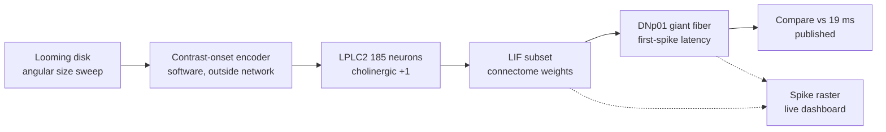

# Architecture

## What the system is

A measurement harness that drives a real spiking network with stimulus *timing*, reads the descending-neuron response, and compares the result to published electrophysiology.

It is an experiment, not an application. The output is a number and a confidence in that number, not an action.



## Component boundaries

| Layer | Responsibility | Where |
|---|---|---|
| **Encoding** | Frame → precisely-timed spike train | **New, in-window.** Modifies `structured_drive.py` |
| **Simulation** | LIF dynamics, synaptic delivery, weights | **Frozen.** Reused unmodified from source |
| **Readout** | Spike counts → latency, first-spike, separability | **New, in-window.** Extends `neural_readout.py` |
| **Experiment** | Sweep, seeds, statistics, falsification checks | **New, in-window** |
| **Dashboard** | Live spike raster and latency comparison | **New, in-window.** React 19 + Tailwind 4 |
| **Reference** | Published values to test against | `docs/Biological-Reference.md`, complete |

### What is frozen and why

The simulation core is reused **unmodified**. Changing weight construction or LIF constants would invalidate comparison against Shiu et al. 2024, which is the entire basis of the reference comparison. `AGENTS.md` §6 requires this: a stale or altered weight cache produces plausible-looking wrong numbers.

Only two things change: how drive enters (timing, not rate) and how the output is read (latency, not rate).

## Neuron selection

Selected by the biology, not by a threshold. Card & von Reyn and PLOS Biol 2025 establish that **97.5% of visual input to the giant fiber comes from LPLC2 (52.2%) and LC4 (45.2%)** — the only two sources.

This means a backward-from-the-output selection rule and the empirical anatomy arrive at the same answer independently. The rule is therefore checkable, not a heuristic.

Primary path: **LPLC2 (185 neurons in subset) → DNp01 (2 neurons)**. Verified present: 185 edges, 4,862 synapses, matching the whole-brain result.

## Known compromises, stated plainly

| Compromise | Consequence |
|---|---|
| Subset begins at the lobula columnar, not the retina | Retinal and lamina processing excluded. Stimulus enters mid-pathway. Latency is therefore expected **below** the published 19 ms, and the writeup must say so. |
| Contrast-onset encoder runs in software, not as lamina neurons | The timing *follows* known photoreceptor→lamina biology, but is not simulated from it. Cannot claim retinal-stage fidelity. |
| No retina-to-lobula chain in the subset | Early-stage vision is not modelled. This is deliberate: 61k neurons of lamina/medulla add cost and no measurable output. |
| Whole connectome used offline only | 165,122 neurons would imply ~40M spikes/step and ~40 s per decision. Not demoable. Retained for offline analysis on disk. |
| Photoreceptor→lamina is inhibitory | Direct drive through that stage produces silence (documented in source). Contrast is injected downstream of it instead. |

## Data flow and trust boundaries

- Weights and annotations: read-only from `D:\Projects\timepass\fruitfly\data\`. Never written.
- Measured results: written to `data/` in this repo. Every number in the UI traces here.
- The dashboard **displays** measurements; it computes none. No measured value may exist only in the UI.
- No network calls in the simulation loop. That constraint is the basis of the project's claim.

## Dashboard

React 19 + Vite 8 + Tailwind 4. UI primitives follow shadcn conventions (composed from `class-variance-authority` + `cn`), installed directly rather than via the shadcn CLI.

State arrives by **1 s polling** of `/api/experiment`, not SSE or WebSocket. Justification: a single LIF step takes 1–2 s, so polling is already faster than the producer. A stream would add a server protocol for no observable gain.

```
src/
  App.tsx                  layout and run controls
  components/
    latency-panel.tsx      headline: measured vs published 19 ms
    raster-panel.tsx       SVG spike raster
    measure-panels.tsx     seed reproducibility, separability
    ui/                    button, card, badge, progress
  lib/
    experiment.ts          types and reference constants
    useExperiment.ts       polling hook and control client
```

Saturation is displayed as a **first-class state**, not hidden. When the giant fiber is at its refractory ceiling the panel shows `SATURATED — result unreliable` regardless of the measured value, because `docs/Biological-Reference.md` pre-registers saturation as the known confound.

Related: [[Home]] · [[Biological-Reference]] · [[Experiments]] · [[Roadmap]]