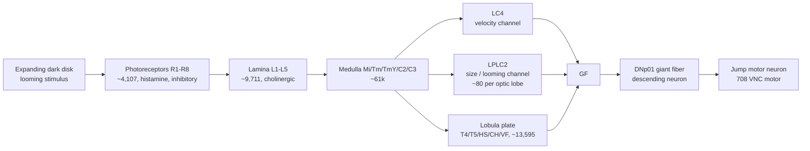

# Biological Reference Targets

Measured values from published *Drosophila* electrophysiology, to test the model against. This file is the reference side of the experiment: we measure something in simulation, then compare it to what a real animal does.

Every value here is a **target to compare against**, not a result we have produced. Project rule `AGENTS.md` §6 applies: nothing measured by us may be written into this file.

## Why compare at all

A simulation that runs is not the same as a model that is faithful. The only way to know whether the model is faithful is to measure a quantity that has been measured in a real animal and check the two agree.

The MaleCNS v1.0 parameterisation is published (Shiu et al. 2024, *Nature* 634:210–219), and LIF constants are traced to named sources (`[[Simulation-Model]]` in the source project). That means quantitative comparison is legitimate, not decorative.

## The pathway we target

## Primary target: DNp01 (giant fiber) latency

| Quantity | Value | Source |
|---|---|---|
| Sensory latency (δ₁), stimulus onset → transient GF response | **19 ms** | Ache et al. 2019, *Curr Biol* — model fit, C₁ = 0.0002567, δ₁ = 0.019 s |
| GF input composition from optic lobe | **97.5%** from LPLC2 (52.2%) + LC4 (45.2%) | Card & von Reyn; PLOS Biol 2025 (v1.2.1 hemibrain) |
| Remaining GF visual input | 38% of all GF inputs come from non-optic-lobe neurons | PLOS Biol 2025 |

**This is the headline experiment.** Drive LPLC2 with contrast-onset timing, measure DNp01 first-spike latency, compare to 19 ms.

Interpretation:
- **Match** → the model is faithful on the one pathway with strong electrophysiology behind it.
- **No match** → report the discrepancy and its cause. A divergence with an identified cause is a result, not a failure.

**Caveat we must state:** 19 ms is measured from *disk appearance* to GF response in a real eye. Our stimulus enters at the lobula columnar, not the retina (`[[Architecture]]`), so our latency excludes retinal and lamina processing time. A match would therefore be a stronger result than it first appears, and a mismatch is expected to be *smaller* than 19 ms. We predict a latency **below** 19 ms and will say why.

## Secondary target: looming size threshold

| Quantity | Value | Source |
|---|---|---|
| η (size) component peak | **42°** angular size | von Reyn et al. 2017, via Ache et al. 2019 |
| ρ (velocity) component | linear in angular velocity | von Reyn et al. 2017 |
| Peak response time vs r/v | linear for ρ, Gaussian-thresholded for η | Ache et al. 2019, Fig. 4 |

A contrast-onset encoder driven at a fixed expanding disk should produce a GF response that peaks at a characteristic angular size. Comparing that peak to 42° tests the *stimulus-response tuning*, not just the latency.

## Tertiary target: escape-mode consequence

| Quantity | Value | Source |
|---|---|---|
| Single GF spike timing determines short vs long escape | qualitative | Card & von Reyn; Ache et al. 2019 |
| Short-mode takeoff advantage | ~8 ms faster than long mode | Card, HHMI / Janelia |

Relevant because it justifies the whole timing-first design: in the real animal, **one spike's timing** changes the behaviour. This is the strongest published argument against rate-only readout, and it should appear in the writeup.

## Anatomical facts constraining the model

| Fact | Value | Source |
|---|---|---|
| LPLC2 population | ~80 per optic lobe, cholinergic (+1) | Klapoetke et al. 2017; Virtual Fly Brain FBbt_00111763 |
| LPLC2 selectivity | radial motion opponency — outward motion, not inward | Klapoetke et al. 2017 |
| LPLC2 arbors | layers 4 and 5B (presynaptic in 4), spans ~25 optic columns | Klapoetke et al. 2016; VFB |
| Photoreceptor→lamina sign | **inhibitory** (histamine, −1) | measured in source `docs/Visual-Pathways.md` |
| LPLC2 in our subset | **185 neurons** | source `data/visual-subset-male-cns-v1.0.meta.feather` |
| LPLC2→DNp01 | present, 185 edges, 4,862 syn — matches whole brain | source `extract_visual_subset.py` validation |

## What this reference implies for neuron selection

The 97.5% figure is the important one. It means a **backward-from-the-output selection rule and the biology independently arrive at the same answer**: LPLC2 and LC4 are the only visual inputs to the descending neuron we can read.

So neuron selection is not a heuristic. It is:

> Keep the neurons that provably carry the visual signal to the output. LPLC2 + LC4 + DNp01.

That is checkable against Card & von Reyn, and a judge can verify it. This supersedes the earlier arbitrary threshold rule.

## Falsification criteria (state these before measuring)

Per `AGENTS.md` §6, an experiment that cannot fail proves nothing. Pre-registered:

1. **Latency test fails if** DNp01 first-spike latency is not reproducible across seeds, or is dominated by the simulation refractory period rather than synaptic delay.
2. **Size-threshold test fails if** peak angular size is not reproducible across seeds, or the peak lands on the stimulus-set boundary (meaning the range is too narrow to locate the maximum).
3. **Any test fails if** results depend on the drive amplitude used to reach the output — i.e. the output is still saturated. **Saturation is the known confound and must be reported even when tests pass.**

## Sources

- Ache, J.M. et al. 2019. Neural Basis for Looming Size and Velocity Encoding in the *Drosophila* Giant Fiber Escape Pathway. *Current Biology* 29(6). PMID 30827912.
- Klapoetke, N.C. et al. 2017. Ultra-selective looming detection from radial motion opponency. *eLife* 6:e21520. PMID 29120418.
- von Reyn, C.R. et al. 2017. Neural Basis for Looming Size and Velocity Encoding (feature models). *Current Biology*.
- Card, G.M. & von Reyn, C.R. The Drosophila escape motor circuit shows differential vulnerability to aging. *PLOS Biology* 2025.
- Wu, Y. et al. 2016. Visual projection neurons in the *Drosophila* lobula link feature detection to distinct behavioral programs. *eLife* 5:e21022.
- Shiu, J. et al. 2024. Whole-brain simulation of the fruitfly. *Nature* 634:210–219.
- Virtual Fly Brain, FBbt_00111763 (LPLC2 anatomy).
- HHMI / Janelia, "Quick Getaway: How Flies Escape Looming Predators" (Card).

Related: [[Home]] · [[Experiments]] · [[Problem-Statement]]